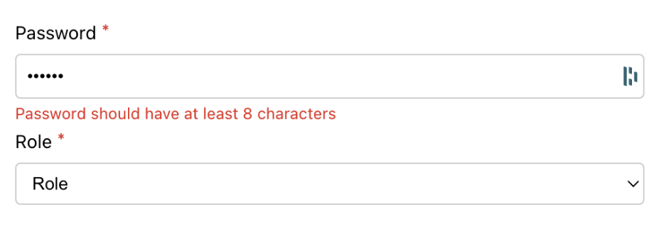

This is a project of the  Advanced React Module of the Meta Front-End Developer Professional Certificate. The idea of this project was to create controlled components and forms, in React, for a restaurant.
The main tasks to complete the project are given below:

-

Este é um projeto do Módulo React Avançado do Certificado Profissional de Desenvolvedor Front-End Meta. A ideia deste projeto foi criar componentes e formulários controlados, em React, para um restaurante.
As principais tarefas para concluir o projeto são fornecidas abaixo:

## Steps

### **Step 1**

Open the `App.js` file.
Convert all the elements from the form to controlled components by adding the value and onChange attributes to each input.
Make sure the password input is obscured.

### **Step 2**

Show an error message if the password is less than 8 characters long and the user has interacted with the input at least once.
The error message should be displayed below the password input as follows.

For that, a component called `PasswordErrorMessage` has been provided to you. Your goal is to implement the logic for when to show the error message.
The password state is a special one that has an additional property called `isTouched`. This property is used to determine if the user has interacted with the input or not.

### **Step 3**

Prevent the default behaviour of the form when the user clicks the submit button.

### **Step 4**

Implement the body of `getIsFormValid` function to return `true` if the form is valid and `false` otherwise. This determines the submit button state. The rules for the form to be valid are as follows:
- The first name cannot be empty.
- The email must be a valid email address and can't be empty. A function called `validateEmail` has been already provided for you to check if the email is valid. It returns `true` if the email is valid and `false` otherwise.
- The password must be at least 8 characters long
- The role must be either `individual` or `business`

### **Step 5**

Implement the body of `clearForm` function to clear the form state after a successful submission.

### **Tip**

React offers two focus events for form elements: `onBlur` and `onFocus`.
